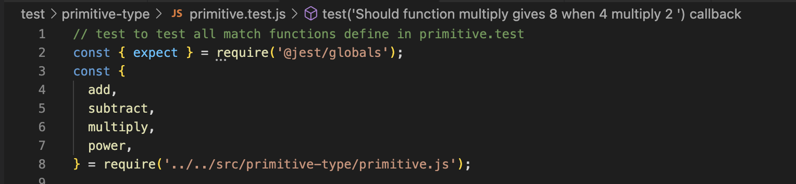
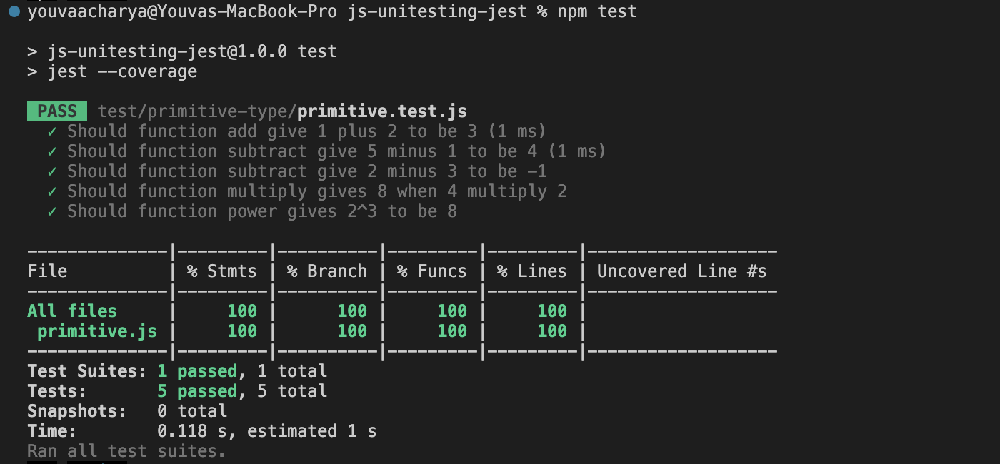
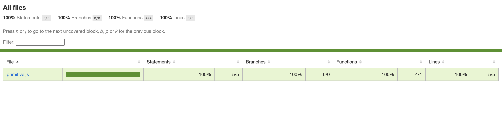

# Unit Testing with Jest

This is a quick summary of how to create a new npm project and perform js unit testing with Jest

## Getting Started

### Setup

- Ensure you have node js installed v16+ is preferred
- Create a new folder for your poject. Let say 'js-unit-jest'
- Open the terminal and go inside the project folder
- Initialize the npm project you can use the default option
  ```
  npm init -y
  ```
- Install jest .You can install as dev dependecies.
  ```
  npm install --save-dev jest
  ```

### Folder structure

You can organize the module files and test files the way you wanted. It is usually a good idea to put modules under 'src' and tests under 'test' folder.

### Creating module and writing test

- Create a JavaScript file for the module you want to test, for example, myModule.js

- Write the code for your module in myModule.js. This could be a function, a class, or any JavaScript code you want to test

- Create a test file for your module. By convention, Jest looks for test files with names ending in .test.js or .spec.js. So, for myModule.js, you could create myModule.test.js.

- In your test file (../primitive.js.js), import the module you want to test.
- Import the expect from Jest to perform assertion
  Write test functions using Jest's testing functions like test, describe, and expect. For example below



### Executing program

- Execute your tests by running npx jest
- or you can add command to 'test' in package.json

  ```
  // package.json

  "scripts": {
    "test": "jest --coverage"
  },
  ```

- and perform the command below

```
npm test
```

## Review Test Results

Jest will display test results, including pass/fail information and any errors or failures encountered during testing.

If you had run with the 'jest --coverage' option you will see the report like below / also html file will be generated.



And inside coverage/lcov-report index.html file will be created.



## Authors

Youva Acharya\
youvaraj@gmail.com
